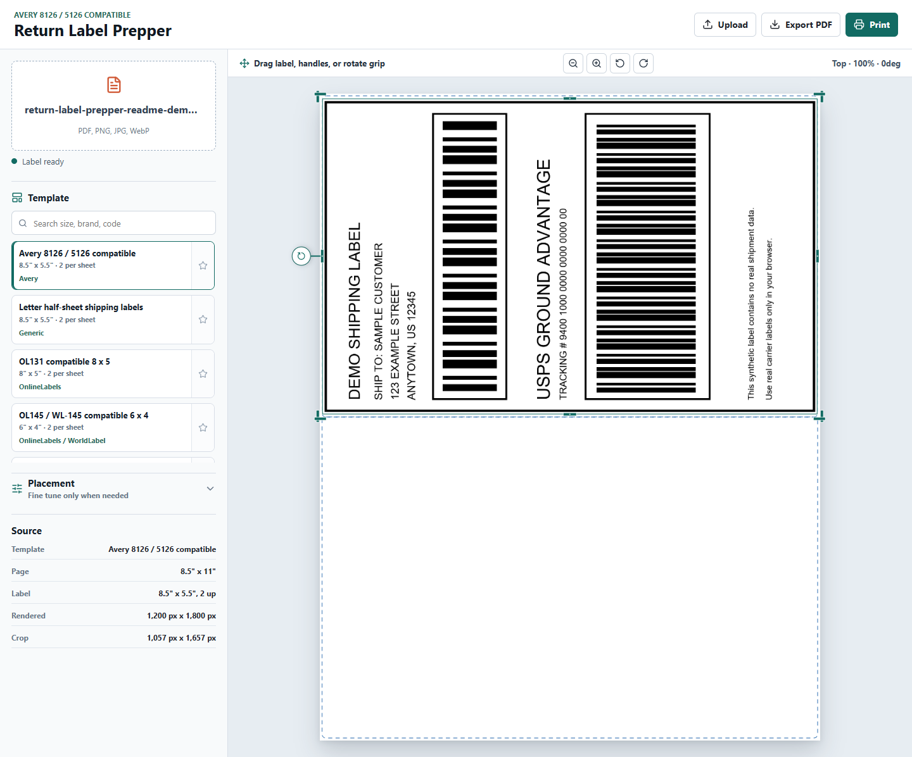
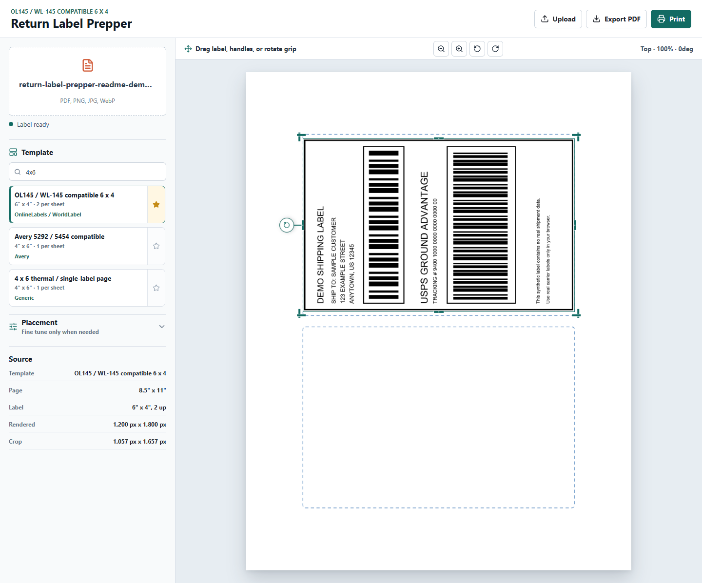

# Return Label Prepper

Return Label Prepper is a browser-only utility for turning carrier return labels into print-ready sheets for common package shipping label templates. Upload a PDF or image, let the app crop the actual label, choose a print-at-home template, adjust the fit if needed, then export or print a correctly sized PDF.

The app is designed for USPS, UPS, FedEx, Amazon, marketplace returns, small shops, and anyone who has a label file but needs it aligned to real label paper.



## Why It Exists

Carrier labels often arrive as awkward PDFs with extra whitespace, the wrong page size, or a single 4" x 6" label floating on Letter paper. That makes printing onto Avery or equivalent label sheets annoying and wasteful.

Return Label Prepper fixes that locally in your browser:

- Crops away surrounding whitespace.
- Places the label onto package-friendly templates.
- Supports live alignment, scaling, and rotation.
- Exports a printable PDF using the selected template's page size.
- Keeps files private by processing them client-side.

## Features

- **Local PDF/image processing**: Supports PDF, PNG, JPG, JPEG, and WebP uploads.
- **Auto-crop**: Detects the visible label area and removes surrounding blank space.
- **Package label templates**: Includes parcel-safe templates such as Avery 8126/5126, Avery 5292/5454, 4" x 6" thermal pages, half-sheet labels, 8" x 5" labels, 6" x 4" two-up sheets, and full-page labels.
- **Template browser**: Search by brand, product code, size, or labels per sheet.
- **Favorites**: Favorite templates and persist the last selected template in browser storage.
- **Visual placement controls**: Drag the label, pull handles to scale, and use the rotate grip for fine angle changes.
- **Page preview controls**: Zoom or rotate the whole preview without changing the exported label geometry.
- **Export and print**: Download a print-ready PDF or open the browser print flow directly.
- **Guide toggle**: Show/export guide outlines when helpful.



## Template Coverage

The built-in catalog intentionally focuses on labels suitable for package shipping, not small return-address or standard address labels.

Included examples:

- Avery 8126 / 5126 compatible half-sheet labels.
- Generic Letter half-sheet labels.
- OnlineLabels OL131 compatible 8" x 5" labels.
- OnlineLabels OL145 / WorldLabel WL-145 compatible 6" x 4" two-up labels.
- Avery 5292 / 5454 compatible 4" x 6" labels.
- Generic 4" x 6" thermal/single-label pages.
- Full-page Letter label/plain paper.

## Getting Started

Install dependencies:

```bash
npm install
```

Run the development server:

```bash
npm run dev
```

Open:

```text
http://127.0.0.1:5173/
```

Build for production:

```bash
npm run build
```

Preview the production build:

```bash
npm run preview
```

## Basic Workflow

1. Upload a carrier label PDF or image.
2. Pick a template from the template browser.
3. Choose a slot when using a multi-label sheet.
4. Use the preview handles only if the automatic placement needs adjustment.
5. Export the PDF or print directly.

## Privacy

Return Label Prepper is intentionally client-side. Uploaded labels are rendered and transformed in the browser; there is no backend service and no file upload step.

If hosted as a static site, the host serves the app code, but label processing still happens locally in the user's browser.

## Tech Stack

- Vite
- React
- TypeScript
- `pdfjs-dist` for PDF rendering
- `pdf-lib` for generated print PDFs
- `lucide-react` for icons

## Notes

- PDF uploads use the first page in v1.
- Export uses 300 DPI raster output for reliable barcode-safe printing.
- Settings, favorites, and the selected template are stored in `localStorage`.
- Avery 8126 compatible half-sheet labels are the default template.

## Deployment

This app can be hosted as a static site. Good low-cost options include:

- GitHub Pages
- Cloudflare Pages
- Netlify
- Vercel

Build command:

```bash
npm run build
```

Output directory:

```text
dist
```
